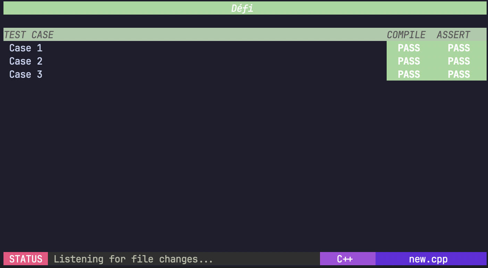
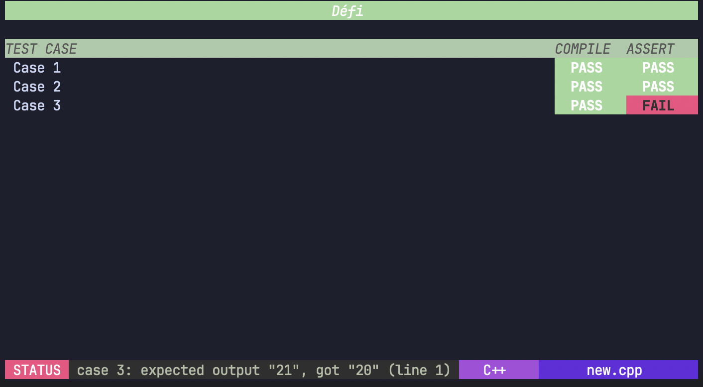

# Défi

Défi is a Golang-powered companion for compiling and validating command-line challenges. It watches your source files, parses inline test prompts, compiles the submission, and renders a rich terminal UI so you can iterate quickly and confidently.

## Features

- Watches challenge files and re-runs the pipeline automatically
- Parses annotated `/*defiprompt … */` blocks for multi-case I/O tests
- Differentiates compilation vs. assertion failures in the UI
- Provides a styled header/footer with live status, language, and filename hints
- Gracefully supports a one-shot `--once` mode for CI or scripted runs

## Prerequisites

- Go 1.25 or newer (for building Défi)
- Target language toolchain (currently C++ via the `c++` CLI)
- A terminal that supports ANSI styling (recommended for the UI components)

## Installation

```bash
go install github.com/pedrohff/defi@latest
```

Run the binary from your `GOBIN`, or execute in-place during development with `go run .`.

## Usage

### Watch mode (default)

```bash
defi path/to/myChallenge.cpp
```

Défi resolves the latest matching file, starts the watcher, and re-runs tests whenever the file changes. Use `--interval N` to adjust the watch polling interval (seconds).

### Single run

```bash
defi --once path/to/myChallenge.cpp
```

Ideal for CI or quick verification; Défi compiles, executes the test cases once, prints a summary, and exits.

### Flags

| Flag          | Description                                   | Default |
|---------------|-----------------------------------------------|---------|
| `--once`      | Run a single evaluation then exit              | `false` |
| `--interval`  | Watcher polling cadence in seconds            | `1`     |

## Supported languages

| Language | File extension | Required CLI |
|----------|----------------|--------------|
| C++      | `.cpp`         | `c++`        |

Language detection drives footer labels and build commands. Extend `supportedLanguages` in `workflow.go` to add more toolchains.

## Authoring test prompts

Défi infers test cases from comment blocks. Each `INPUTS` / `OUTPUT` pair separated by `-*-` creates an independent scenario.

```c++
/*defiprompt
INPUTS:
2
1
2
OUTPUT:
3
-*-
INPUTS:
3
3
4
6
OUTPUT:
13
-*-
INPUTS:
4
1
7
1
1
OUTPUT:
10
*/
```

When Défi runs, each case is compiled, executed, and rendered using the TestCase component. Compilation or assertion failures are highlighted independently so you know exactly what failed.

## UI overview & screenshots





